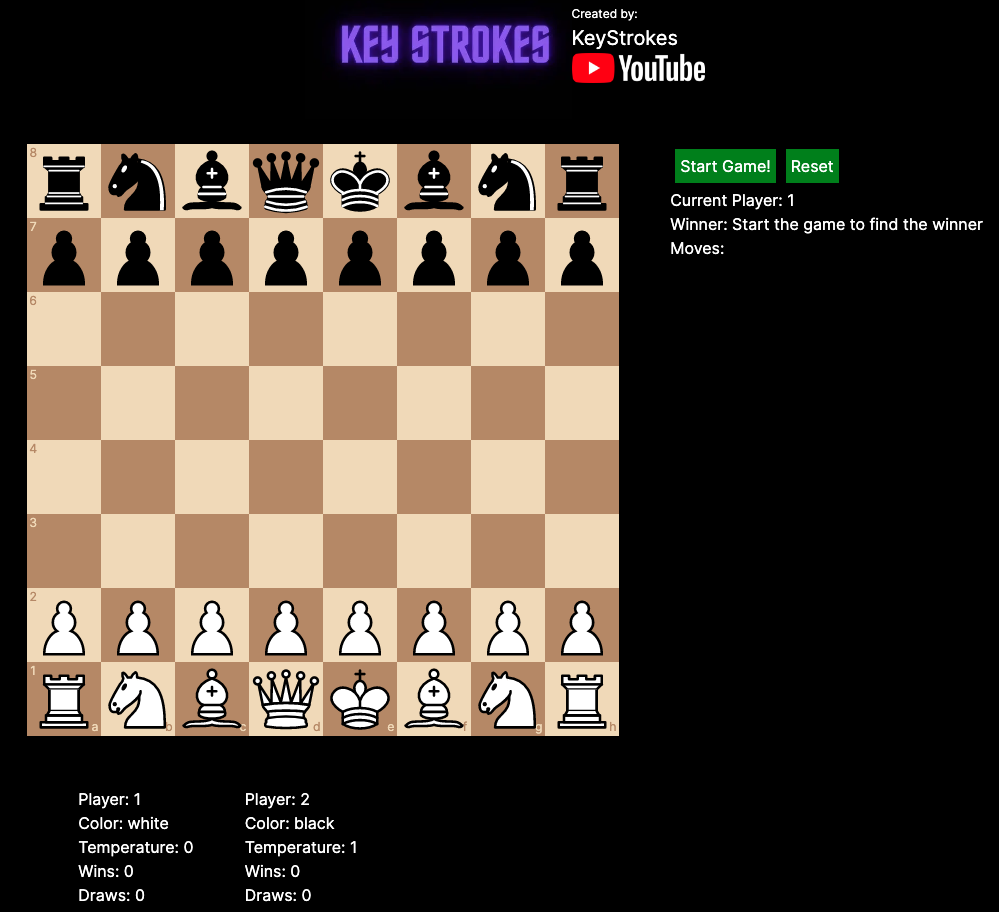

# ChatGPT Chess

Build a Chess Game powered by ChatGPT, where both the players are ChatGPT with different temperature settings!

## Video Link

## Preview

# Running the app
1. Update `NEXT_PUBLIC_OPENAI_API_KEY` in `.env` file with your Open AI API Key.
1. Run the `npm install` to setup the dependencies following commands 
1. Run the `npm run dev` to start the server

Access the project page at http://localhost:3000/

## Find me here 

 

## Support me:

  

## Note
Please note, this is for demonstration purposes only. Do not deploy this to production without making certain changes.

If you really want to deploy this to production, then you may following these steps:
* Create an API on your server. This API will call the ChatGPT API, and use the API Key
* Remove API Key from this repository, and any ChatGPT API Integration
* Integrate with the new API that you created on your server.
* Add various protection to your APIs, like authentication, authorization, throttling etc

There are many other best practices that need to be implemented. But the above two summarize the most important ones. If someone really deploys this to production, then please send a pull request with a more comprehensive list.
